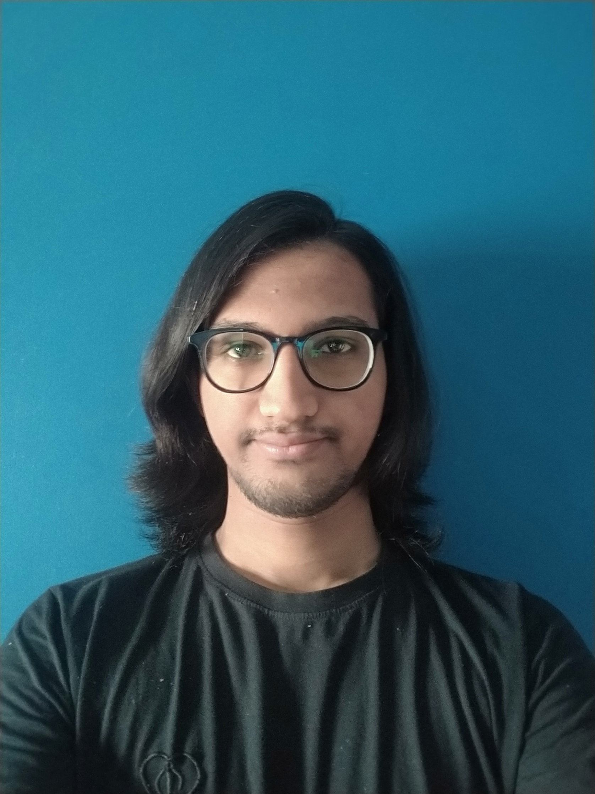

R Pranav Ajay
============
### Objective:
  An enthusiastic and dedicated freshman, looking to enter the world of
  Software Development, with the motive of helping the organization
  accelerate its goal and also learning in the journey.

### Communication:
  Email: pranav.ajay2000@gmail.com\
  GitHub ID: [sairpa](https://github.com/sairpa)\
  [Website](https://sairpa.github.io/)\
  Blog: [Blogger](https://rpatechie.blogspot.com/)\
  Blog: [Personal Blog](https://sairpa.github.io/Blog/)\
  
### Education
| Year | Name | Details |
| --- | --- | --- |
| 2018-2022 | Amrita School of Enginnering | (Undergoing) BTech Computer Science and Engineering CGPA - 8.05/10 (Until Semester-6) |
| 2017-2018 | Maharishi International Resisdential School | Board: CBSE   Marks: 455/500 ~ 91% |
| 2015-2016 | Maharishi International Resisdential School | Board: CBSE   CGPA - 10/10 ~ 100% |

### Achievements
  * Active Member of NSS (National Service Scheme)
  * Was part of Live-in-Labs Programme

### Projects:
| Role/Name | Details |
| --- | --- |
| UI/UX Developer  Palladium OS  (On-going) | Part of the Core Team in formulating and designing  UI and UX at Team Palladium  [Project Link](https://www.palladiumos.com/) |
| Content Creator  Palladium OS  (On-going) | Part of the Social Media Content Creation and distribution for  promotional activities at Team Palladium  [Project Link](https://www.youtube.com/channel/UC4pyGxm1WRMGl_wd8rzdnug)|
| ToonLytV2 | An Android App with Pastiche creation abilities based on Google's project on Neural Style Transfer [Project Link](https://github.com/sairpa/ToonLytV2)|
| Kreative Rum | A collection of my digital art, 3D rendered models [Project Link](https://github.com/sairpa/kreative_rum)|
| Boredom Reliever | Collection of Games and Utilities that are multiplatform compatible and is powered by Java [Project Link](https://github.com/Somnath1708/Boredom-Reliever)|

### Technical Skills:
* Programming Languages: C++, C, Python, Kotlin, Java
* Operating System: Windows,  Linux Distributions ( Debian & Arch based)
* Frameworks: Android SDK, OpenCV, Tensorflow, Unity  

### Technical Interests:
* Operating Systems
* Computational Photography
* Content Creation

### Extracuricular Activities:
* Digital Art and Illustration
* Long Distance Runner
* Watching and Playing Football

-----------------
